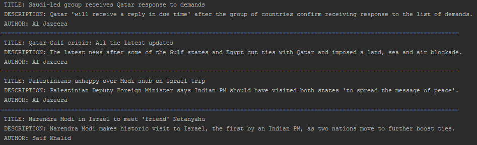

# NEWS BREAKER

News breaker is a command line application written in Python using the click module.

The application uses the [News API](https://newsapi.org) to provided news articles
from four credible news sources [BBC](http://www.bbc.com/), [Bloomberg](https://www.bloomberg.com/africa), [BuzzFeed](https://www.buzzfeed.com/) and [Al Jazeera](http://www.aljazeera.com/)

## How it works

After installing the application a `new` command becomes available and that is 
what you need to run in the terminal.

`$ new`

Enter the number corresponding to the new source that is 
of interest to you or press enter to use `1` as the default(BBC)

A list of news articles is then shown

## Set up
To install the app all you need to do is create a virtual environment and then
run `pip install --editable .` with in the project folder.

